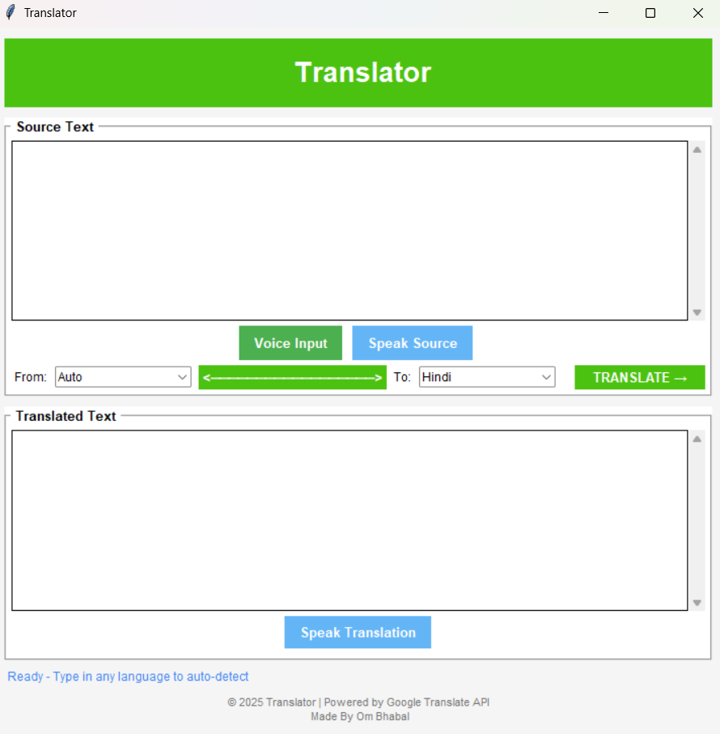

# 🎤🌍 Translator App

A modern desktop **Translator App** built with Python and Tkinter.  
It supports **Text Translation, Voice Input (Speech-to-Text), and Text-to-Speech** — just like Google Translate!  


---

## ✨ Features
- 🌐 Translate text between 100+ languages using **Google Translate**
- 🎤 Voice input (speech recognition via microphone)
- 🔊 Listen to both source and translated text
- 🎨 Clean and simple Tkinter-based UI
- 🗑️ Automatic cleanup of temporary audio files
- ⚡ Fast and lightweight (runs offline except for translation API)

---

## 🛠️ Installation

### 1. Clone the Repository
```bash
git clone https://github.com/Ombhabal/translator-app.git
cd translator-app
```

### 2. Create a Virtual Environment (Python 3.13 recommended)
```bash
python -m venv .venv
```
Activate it:
- **Windows (PowerShell):**
  ```bash
  .venv\Scripts\Activate
  ```
- **Linux/MacOS:**
  ```bash
  source .venv/bin/activate
  ```

### 3. Install Dependencies
```bash
pip install -r requirements.txt
```
---

## ▶️ Run the App
```bash
python google_translator.py
```
---
## 📂 Project Structure
```bash
translator-app/
│── google_translator.py   # Main app
│── requirements.txt       # Dependencies
│── README.md              # Project guide
│── .gitignore             # Ignore cache/venv files
│── screenshot.png         # UI preview
```
---
## 📸 Screenshot
Here’s how it looks:


---
## 🙌 Credits
- 📝 Translation: [deep-translator](https://pypi.org/project/deep-translator/)
- 🔊 Text-to-Speech: [gTTS](https://pypi.org/project/gTTS/)
- 🎶 Audio Playback: [pygame](https://www.pygame.org/)
- 🎤 Speech Recognition: [SpeechRecognition](https://pypi.org/project/SpeechRecognition/)
---
## 📄 License
```bash
MIT License

Copyright (c) 2025 Om bhabal

Permission is hereby granted, free of charge, to any person obtaining a copy
of this software and associated documentation files (the "Software"), to deal
in the Software without restriction, including without limitation the rights
to use, copy, modify, merge, publish, distribute, sublicense, and/or sell
copies of the Software, and to permit persons to whom the Software is
furnished to do so, subject to the following conditions:

The above copyright notice and this permission notice shall be included in all
copies or substantial portions of the Software.

THE SOFTWARE IS PROVIDED "AS IS", WITHOUT WARRANTY OF ANY KIND, EXPRESS OR
IMPLIED, INCLUDING BUT NOT LIMITED TO THE WARRANTIES OF MERCHANTABILITY,
FITNESS FOR A PARTICULAR PURPOSE AND NONINFRINGEMENT. IN NO EVENT SHALL THE
AUTHORS OR COPYRIGHT HOLDERS BE LIABLE FOR ANY CLAIM, DAMAGES OR OTHER
LIABILITY, WHETHER IN AN ACTION OF CONTRACT, TORT OR OTHERWISE, ARISING FROM,
OUT OF OR IN CONNECTION WITH THE SOFTWARE OR THE USE OR OTHER DEALINGS IN THE
SOFTWARE.
```
---
